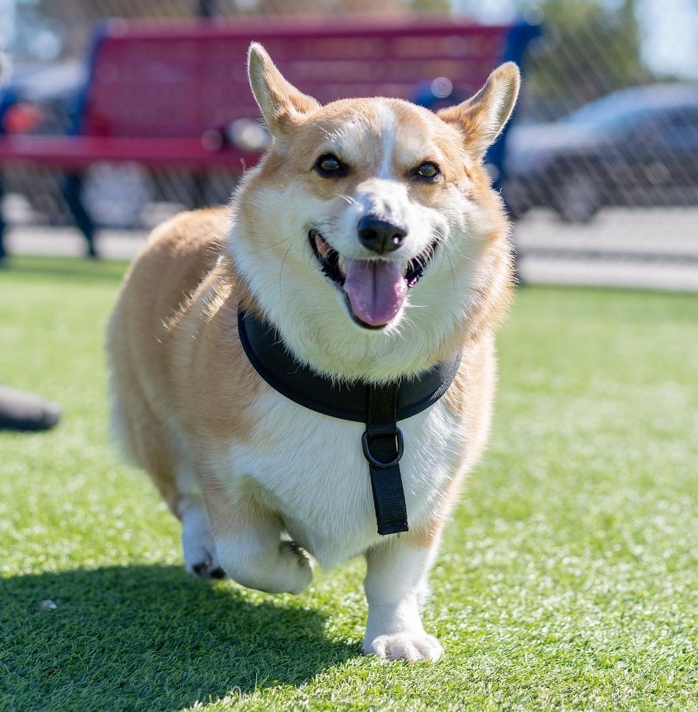
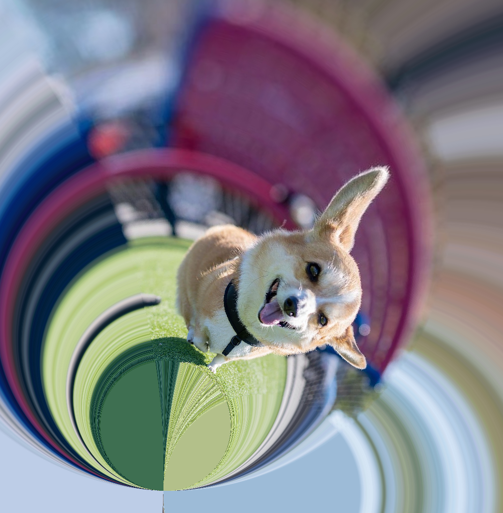
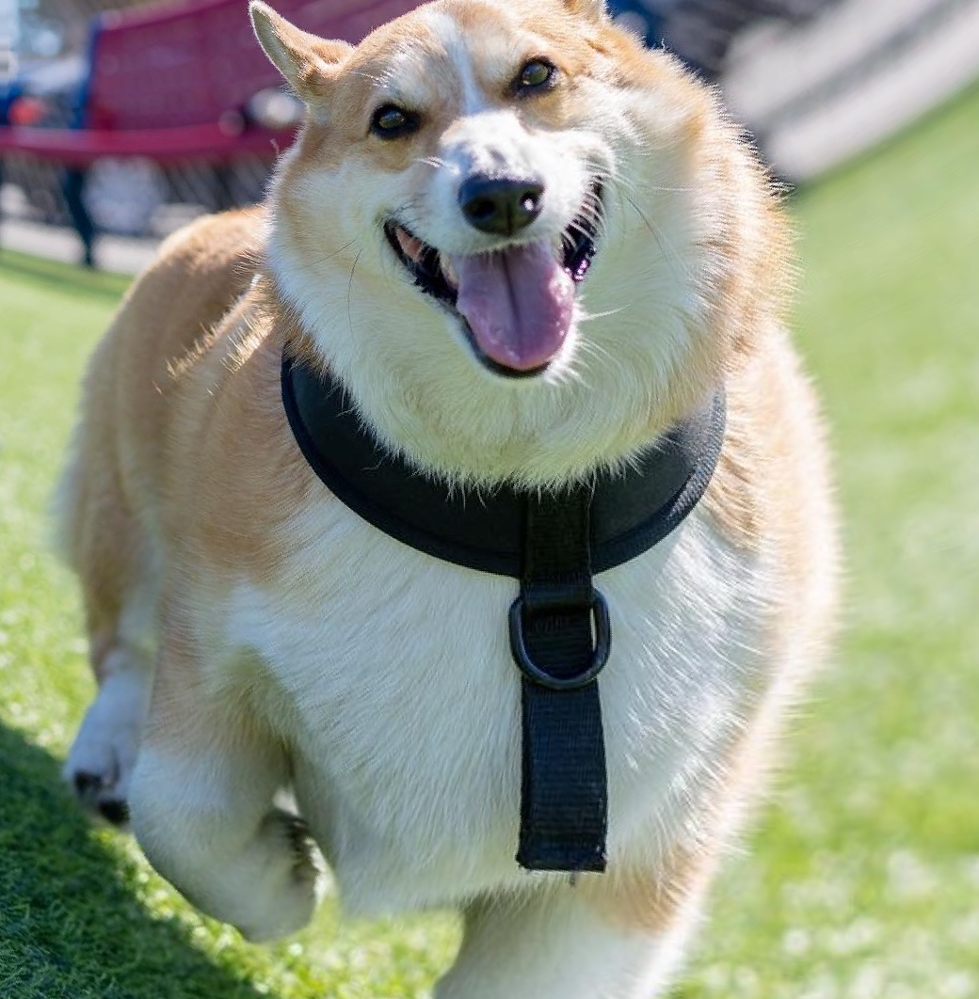

# Mobius 

Official repository for the paper [Data augmentation with Mobius transformations](https://arxiv.org/abs/2002.02917) by <a href="https://www.twitter.com/realsharonzhou">Sharon Zhou</a>, <a href="https://www.linkedin.com/in/jiequanzhang" target="_blank">Jiequan Zhang</a>, <a href="https://hjian42.github.io/" target="_blank">Hang Jiang</a>, <a href="https://scholar.google.com/citations?user=hYgvkugAAAAJ&hl=en" target="_blank">Torbjörn Lundh</a>, and <a href="https://scholar.google.com/citations?user=mG4imMEAAAAJ&hl=en" target="_blank">Andrew Ng</a>.

## Mobius Demo
Apply Mobius transformations to your images!

### Examples

Original Images:




Outputs:







Change the filename in Mobius_demo.ipynb and you will be able to apply Mobius transformations to your own images! :)

## Mobius Data Augmentation
Navigate to `mobius_data_augmentation`. Make sure you have downloaded the respective datasets to their folders specified in `train.py`. Feel free to experiment with different parameters.

Experimental settings in the paper (to be run in the `mobius_data_augmentation` folder):

### Mobius
```
python train.py --data_augmentation mix3 --name mobius
```

### Mobius + Cutout
```
python train.py --data_augmentation mix3 --cutout --name mobius-and-cutout
```

### Cutout 
```
python train.py --data_augmentation regular --cutout --name cutout
```

### Crop-and-flip
```
python train.py --data_augmentation regular --name crop-and-flip
```


